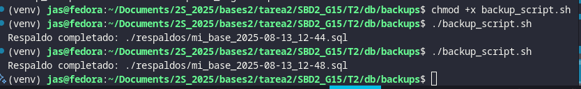
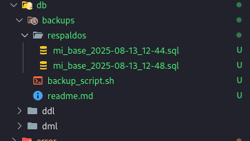
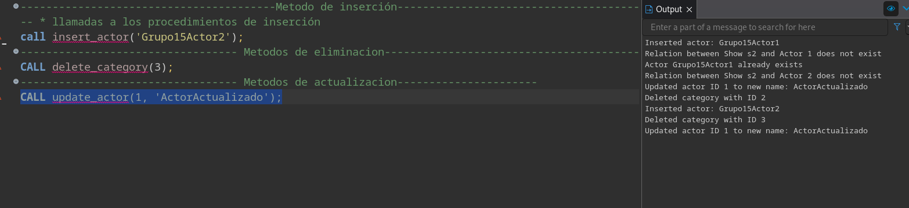

# SBD2_G15

## Tarea 2

## Backup Completo (logic backup)

Crear un script con extension ``.sh`` para automatizar el proceso:

```sh
#!/bin/bash

# Variables
FECHA=$(date +%F_%H-%M)
BACKUP_DIR=./respaldos
ARCHIVO=$BACKUP_DIR/mi_base_$FECHA.sql

# Crear carpeta si no existe
mkdir -p $BACKUP_DIR

# Ejecutar backup lógico desde Docker
docker exec -t my-database-t2 pg_dump -U grupo15 -d bases2-db-t2 > "$ARCHIVO"

# Limpiar respaldos de más de 7 días
find $BACKUP_DIR -type f -mtime +7 -delete

echo "Respaldo completado: $ARCHIVO"
```

### Dar permisos

```bash
chmod +x scriptName.sh
```

### Ejecutar script

```bash
./scriptName.sh
```

### Usado en la tarea



## Ejmplo de salida esperada



## Ejecucion de los procedimientos

