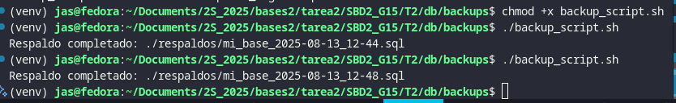
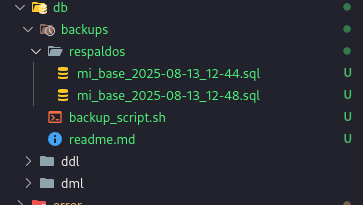

# SBD2_G15 T2

## Backup Completo (logic backup)

Se crea un script en bash para automatizar el respaldo lógico de la base de datos dentro de un contenedor Docker.

```sh
#!/bin/bash

# Variables
FECHA=$(date +%F_%H-%M)
BACKUP_DIR=./respaldos
ARCHIVO=$BACKUP_DIR/mi_base_$FECHA.sql

# Crear carpeta si no existe
mkdir -p $BACKUP_DIR

# Ejecutar backup lógico desde Docker
docker exec -t my-database-t2 pg_dump -U grupo15 -d bases2-db-t2 > "$ARCHIVO"

# Limpiar respaldos de más de 7 días
find $BACKUP_DIR -type f -mtime +7 -delete

echo "Respaldo completado: $ARCHIVO"
```

### Dar permisos de ejecución

```bash
chmod +x backup_script.sh
```

### Ejecutar el script

```bash
./backup_script.sh
```

### Usado en la tarea



## Ejecucion de los procedimientos


## Ejmplo de salida esperada



 **Nota** en 4 segundos se hicieron los procedimientos almacenados, se puede observar en la imagen anteriror.

## Backup Incremental o Diferencial

### Modificar el archivo compose

Para habilitar archivado WAL y permitir backups incrementales/diferenciales, es necesario modificar la configuración de PostgreSQL en el docker-compose.yml.

```bash
archive_mode = on
archive_command = 'test ! -f /var/lib/postgresql/wal_archive/%f && cp %p /var/lib/postgresql/wal_archive/%f'
archive_timeout = 60
```

#### Imagen de muestra de como debe quedar el docker compose


### Reconstruir y levantar contenedores

```bash
docker compose up -d
```

### Backup Full (físico)

Ejecutar un respaldo físico completo usando pg_basebackup:

```bash
docker exec -t my-database-t2 \
  bash -lc "pg_basebackup -U grupo15 -D - -F tar -z -P" \
  > respaldos/base_$(date +%F_%H%M%S).tar.gz
```

#### Ajustar permisos de WAL

Para poder copiar los archivos WAL desde el host:

```bash
docker exec -it my-database-t2 bash -lc 'chmod -R a+r /var/lib/postgresql/wal_archive'
```

### Generar Backup Diferencial/Incremental (WAL Slice)

```bash
stamp=$(date +%F_%H%M%S)
mkdir -p wal_slices/$stamp
# Copia archivos WAL que hayan llegado al host:
rsync -a --ignore-existing ../../../wal-archive/ wal_slices/$stamp/
```

#### Esto genera un archvo ``.tar.gz``


